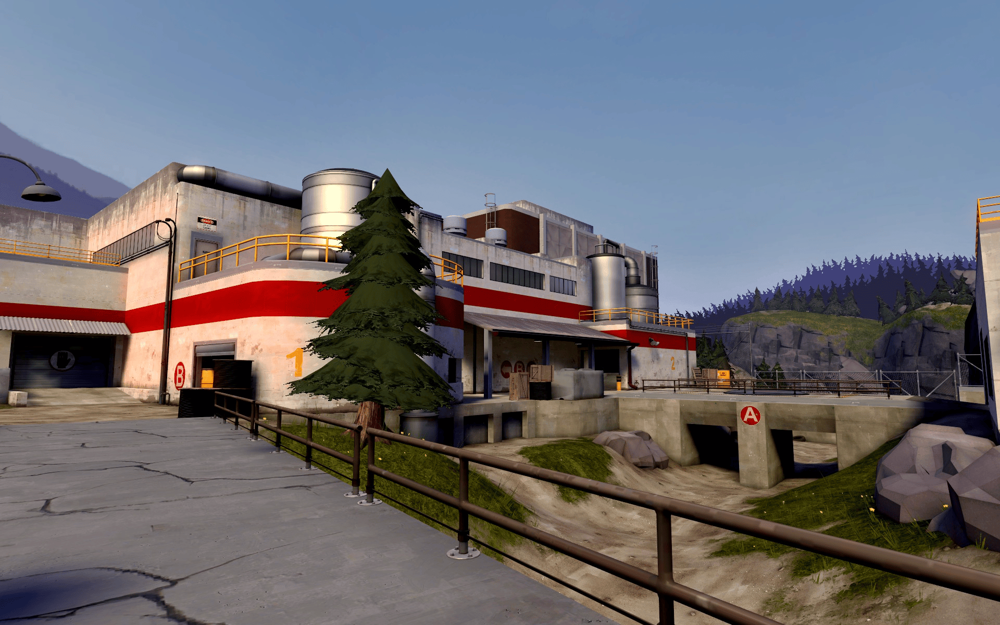
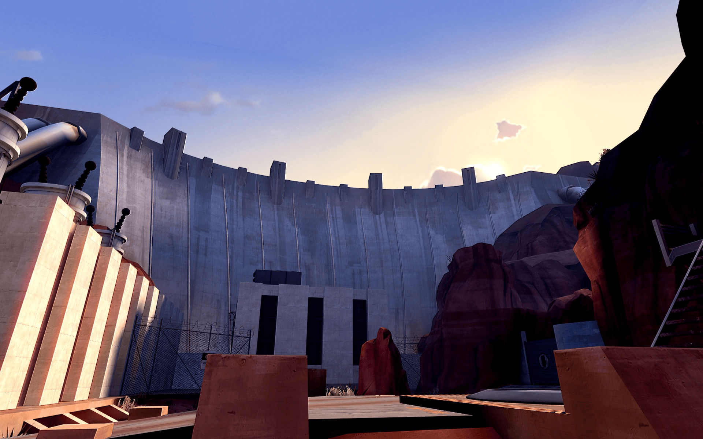
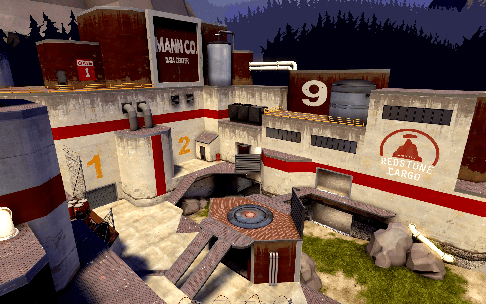

# Project Eternal: TF2 Launcher


A modern, professional launcher for Team Fortress 2, designed to enhance your gaming experience with advanced configuration options, mod management, Discord Rich Presence integration, and a sleek, customizable interface.

## ✨ Features

### Core Functionality
- **Modern UI**: Sleek, dark-themed tabbed interface with smooth animations and custom styling
- **System Tray Integration**: Minimize to system tray for background operation with custom launcher icon
- **Single Instance Prevention**: Automatically prevents multiple instances from running simultaneously
- **Auto-launch Integration**: Seamlessly launches TF2 with your configured settings

### Mod Management
- **Integrated Mod Library**: Browse and manage your installed mods with grid and list view options
- **Visual Mod Cards**: Each mod displays with thumbnail, version, author, and description
- **Toggle Activation**: Enable/disable mods with a single click
- **Mod Filtering**: Filter mods by status (All, Enabled, Disabled)
- **Search Functionality**: Quickly find mods by name

### Discord Rich Presence
- **Custom RPC Integration**: Display your in-game status on Discord
- **Automatic Detection**: Detects when TF2 is running and updates presence accordingly
- **Configurable Settings**: Auto-start RPC with launcher or when game is detected
- **Queue Status**: Shows your matchmaking queue status

### Advanced Configuration
- **Launch Options**: Configure all TF2 launch arguments through a visual interface
  - System & Priority (skip intro, disable joystick, CPU priority, threads, DirectX level)
  - Window & Display (fullscreen, windowed, borderless, resolution, refresh rate)
  - Advanced Flags (disable sound, HLTV, soft particles, steam controller)
- **Autoexec Editor**: Edit your `autoexec.cfg` with organized sections
  - Graphics & Performance (VSync, anti-aliasing, anisotropic filtering, bloom, motion blur, LOD)
  - Gameplay (FOV, viewmodel FOV, sensitivity, auto reload, hit sounds, damage numbers)
  - Interface (net graph, chat time, HUD, competitive settings)
  - Extras (backpack rarities, notifications, ping display, tracers, colorblind assist)
- **Custom Binds**: Create and manage custom key bindings with an intuitive interface
- **Real-time Sync**: Changes are synchronized with your configuration files automatically

### Launcher Configuration
- **Logging Options**: 
  - Enable/disable debug logging
  - Configure log level (Debug, Info, Warning, Error)
  - Auto-clear logs on startup
- **Behavior Settings**:
  - Minimize to tray on launch
  - Close to tray instead of exiting
  - Toggle notifications

### Inventory System
- **Item Browser**: View your TF2 inventory with pricing information
- **Price Cache**: Automatic price caching for faster loading

### News & Blog
- **Integrated Blog**: View latest TF2 news and updates within the launcher

## 📸 Screenshots






## 🚀 Getting Started

### Prerequisites

- **Windows 10/11**
- **.NET 8.0 Desktop Runtime**: [Download here](https://dotnet.microsoft.com/en-us/download/dotnet/8.0)
- **Team Fortress 2** installed via Steam
- **Visual Studio 2022** (for development)

### Installation

1. Clone the repository:
   ```bash
   git clone https://github.com/yourusername/project_eternal_launcher.git
   ```
2. Navigate to the project root
3. Build the project:
   ```powershell
   ./scripts/build.ps1
   ```
   Or manually:
   ```bash
   dotnet build src/LauncherTF2/LauncherTF2.csproj
   ```

### Configuration

1. Launch the application using:
   ```bat
   scripts\run.bat
   ```
   Or open `src/LauncherTF2.sln` in Visual Studio and press **F5**
2. On first launch, set your TF2 installation path (the `tf` folder)
3. Configure your preferred settings in the Settings tab
4. Launch TF2 using the "LAUNCH TF2" button

### Development

For development purposes:
- Open `src/LauncherTF2.sln` in Visual Studio 2022
- The solution uses .NET 8.0 WPF
- Debug logs are written to `bin/Debug/net8.0-windows/app_debug.log`
- Launcher settings are stored in `launcher_config.json`
- Game settings are stored in `settings.json`

## 🏗️ Project Structure

```
project_eternal_launcher/
├── src/LauncherTF2/          # Main application
│   ├── Core/                 # Core utilities (Logger, ViewModelBase, etc.)
│   ├── Models/               # Data models (Settings, Mods, Items, etc.)
│   ├── Services/             # Business logic (GameService, ModManager, etc.)
│   ├── ViewModels/          # MVVM ViewModels
│   ├── Views/                # WPF Views (XAML)
│   └── Resources/            # Embedded resources
├── resources/Assets/         # Images and assets
├── scripts/                  # Build and run scripts
└── docs/                     # Documentation
```

## 🔧 Key Technologies

- **.NET 8.0**: Modern, high-performance framework
- **WPF**: Windows Presentation Foundation for the UI
- **MVVM Pattern**: Model-View-ViewModel architecture
- **Hardcodet.NotifyIcon.Wpf**: System tray integration
- **DiscordRPC**: Discord Rich Presence
- **Newtonsoft.Json**: JSON serialization

## 🤝 Contributing

Contributions are welcome! Please follow these steps:

1. Fork the repository
2. Create a feature branch (`git checkout -b feature/AmazingFeature`)
3. Commit your changes (`git commit -m 'Add some AmazingFeature'`)
4. Push to the branch (`git push origin feature/AmazingFeature`)
5. Open a Pull Request

### Code Style

- Follow existing code style and conventions
- Use meaningful variable and function names
- Add XML documentation for public APIs
- Test your changes thoroughly

## 📄 License

Distributed under the MIT License. See `LICENSE` for more information.

## 🙏 Acknowledgments

- **Cukei** for the Casual Preloader integration
- **Valve** for Team Fortress 2
- **Discord** for Rich Presence API
